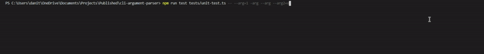

<p align='center'><a href='https://github.com/danitseitlin/cli-argument-parser'></a></p>

<p align='center'>
  <a href='https://github.com/danitseitlin/cli-argument-parser/blob/master/LICENSE'>
    
  </a>
  <a href='https://npmjs.org/package/cli-argument-parser'>
    
  </a>
  <a href='https://npmjs.org/package/cli-argument-parser' style='width:25px;height:20px;'>
    
  </a>
  <a href='https://npmjs.org/package/cli-argument-parser' style='width:25px;height:20px;'>
    
  </a>
</p>

<p align='center'><a href='https://github.com/danitseitlin/cli-argument-parser'></a></p>

## :metal: Quick Start
Run `npm i cli-argument-parser`

## :ok_hand: Basic usage
```
import { cliArguments } from 'cli-argument-parser';
const arg1 = cliArguments.arg1;
const arg2 = cliArguments.arg2;
```
Run a cli with `arg1` and `arg2`, ie: `my-command --arg1=2 --arg2=1`
And the values will be inside the variables we declared above.

## :speak_no_evil: Configurate unique CLI's
### Using a configuration file
Create a file in the root of your project called `cli.config.json`
and paste the following into it:
```
{
    prefix: '--',
    separator: '='
}
```
The `prefix` is a value which the argument must start with, `--` is the default one. (ex: `--arg=5`) <br>
The `separator` is a value which seperated between the argument name and argument value. `=` is the default one. (ex: `--arg=5`) <br>
This gives you the abillity to configurate your cli arguments as you wish. <br>

### Using the CLI
If additional files are a mess in your opinion, it is also possible to pass the CLI configuration via CLI arguments.
`--cli-prefix` to configurate the CLI prefix, ie: `--cli-prefix=--`
`--cli-separator` to configurate the CLI separator, ie: `--cli-separator==`

### Using the code
Instead of using the existing `cliArguments`, you are able to also create your own custom one.
```
import { filterArguments } from 'cli-argument-parser';
const arguments = filterArguments('--', '=');
```
The `arguments` variable will hold a JS object with arguments with the given prefix and separator.